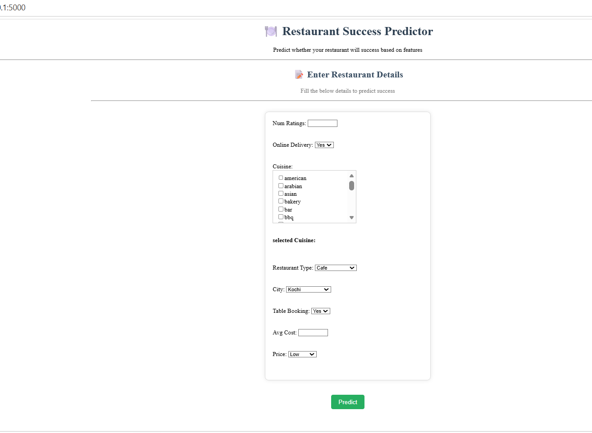
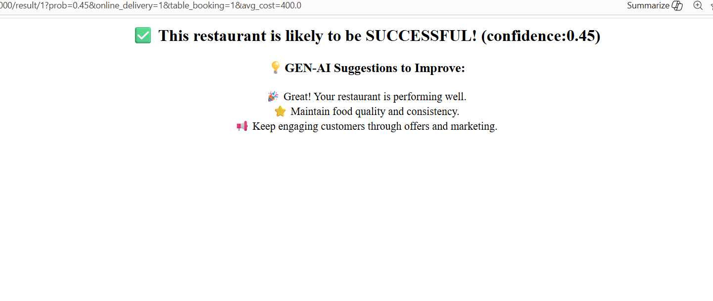
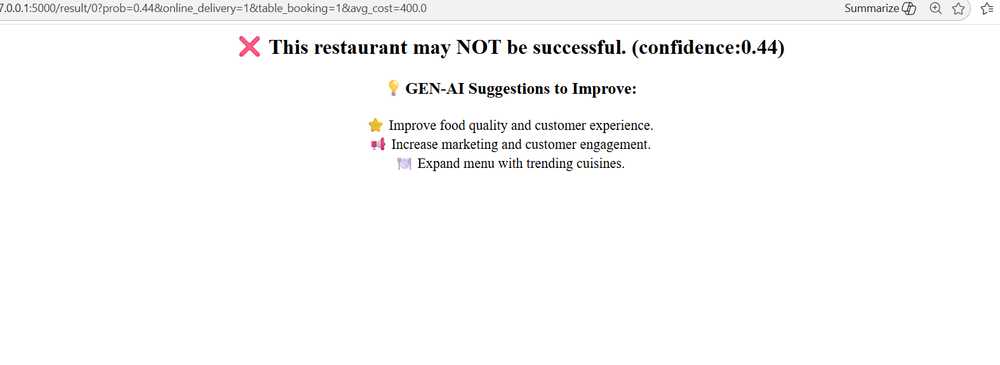

🍽️ Restaurant Success Prediction (FoodTech Analytics)

📌 Project Overview

This project predicts whether a restaurant will be successful or not using Machine Learning.
It also provides AI-based suggestions (GenAI logic) to improve restaurant performance.

🔹 Data Collection

The dataset was collected using web scraping from:

- Wikipedia (for structured information like city/area references)
- Zomato (for restaurant-specific details such as ratings, cuisine, pricing, etc.)

---

📊 Dataset Description

🔹 Initial Columns

- name – Restaurant name
- url – Source link
- rating – Customer rating
- location – Combined city + area
- city – City name
- area – Area name
- cuisine – Food types
- price – Price category
- reviews – Number of reviews
- restaurant_type – Type (Cafe, Fast Food, etc.)
- num_ratings – Total ratings count
- online_delivery – Delivery availability
- table_booking – Booking availability
- avg_cost_for_two – Average cost
- is_delivering_now
- switch_to_order_menu

---

📊 Week 1 – Exploratory Data Analysis (EDA)

🔹 Univariate Analysis

- Distribution of rating
- Distribution of avg_cost_for_two
- Count of restaurant_type

🔹 Bivariate Analysis

- rating vs restaurant_type
- rating vs price
- avg_cost_for_two vs rating

🔹 Data Cleaning

df.drop_duplicates(inplace=True)

🔹 Missing Values

Handled missing values in:

- rating
- cuisine
- price
- avg_cost_for_two

---

⚙️ Week 2 – Data Preprocessing

🔹 1. Missing Value Handling

- rating → group-based mean/median
- cuisine → mode
- price → related feature-based
- avg_cost_for_two → grouped mean

---

🔹 2. Feature Engineering

- Created location tiers:
  - Tier 1 → Major cities
  - Tier 2 → Medium cities
  - Tier 3 → Others

---

🔹 3. Encoding

- Binary Encoding:

df['online_delivery'] = df['online_delivery'].map({'Yes': 1, 'No': 0})
df['table_booking'] = df['table_booking'].map({'Yes': 1, 'No': 0})

- Cuisine → TF-IDF Vectorization
- Restaurant Type → One Hot Encoding (OHE)

---

🔹 4. Feature Scaling

- Applied StandardScaler on:

num_ratings

- Applied Log Transformation on:

avg_cost_for_two

---

🔹 5. Target Variable

df['success'] = df['rating'].apply(lambda x: 1 if x >= 4 else 0)

- 1 → Successful
- 0 → Not Successful

---

🔹 6. Avoiding Data Leakage

df.drop('rating', axis=1, inplace=True)

---

🎯 Problem Type

- Binary Classification
- Goal → Predict restaurant success

---

🚀 Week 3 – Model Training

🔹 Models Used

- Logistic Regression
- Decision Tree
- Random Forest
- Gradient Boosting
- XGBoost
- Extra Trees

---

🔹 Evaluation Metrics

- Accuracy
- Precision
- Recall
- F1 Score
- ROC-AUC

---

🔹 Scaling Observation

Scaling helped:

- Logistic Regression
- SVM
- KNN

Scaling NOT needed:

- Random Forest
- Decision Tree

---

🔹 Final Model Selection

🏆 Random Forest (without scaling, without tuning)

- Accuracy: ~0.72
- ROC-AUC: ~0.80

✔ Best performance
✔ Stable results

---

💾 Model Saving

import pickle
pickle.dump(model, open("random_forest_model_zomato.pkl", "wb"))

---

🌐 Flask Web Application

The model is deployed using Flask.

🔹 Features:

- User input form
- Real-time prediction
- Confidence score
- AI-based suggestions

---

🎯 Prediction Logic  

Instead of direct prediction, probability is used:

proba = model.predict_proba(features)[0][1]  
prediction = 1 if proba > 0.5 else 0  

🔹 Why threshold = 0.5?

- Standard classification threshold  
- Balances Precision and Recall  
- Reduces false positives compared to lower thresholds  
- More generalizable across datasets

---

🤖 GenAI Suggestion System

This project includes a rule-based intelligent suggestion engine.

🔹 How it works

Suggestions are generated based on:

1. Model prediction (success/failure)
2. Input features (delivery, booking, pricing)

---

🔹 Case 1: SUCCESS (prediction = 1)

Even when successful, the system provides growth suggestions.

Example:

🎉 Great! Your restaurant is performing well.
🚀 Adding online delivery can further boost growth.
📅 Table booking can improve customer experience.
⭐ Maintain food quality.
📢 Continue marketing strategies.

---

🔹 Case 2: FAILURE (prediction = 0)

Provides corrective suggestions.

Example:

🚀 Enable online delivery
📅 Add table booking
💰 Reduce pricing
⭐ Improve food quality
📢 Increase marketing
🍽️ Expand menu

---

🔹 Key Idea

- Rule-based intelligent system
- Based on real inputs
- Works alongside ML prediction

---

📸 Output Screens

### - Input form page
-

### - Successful prediction
-

### - Failed prediction
_

---

👩‍💻 Author

Jayalekshmi
